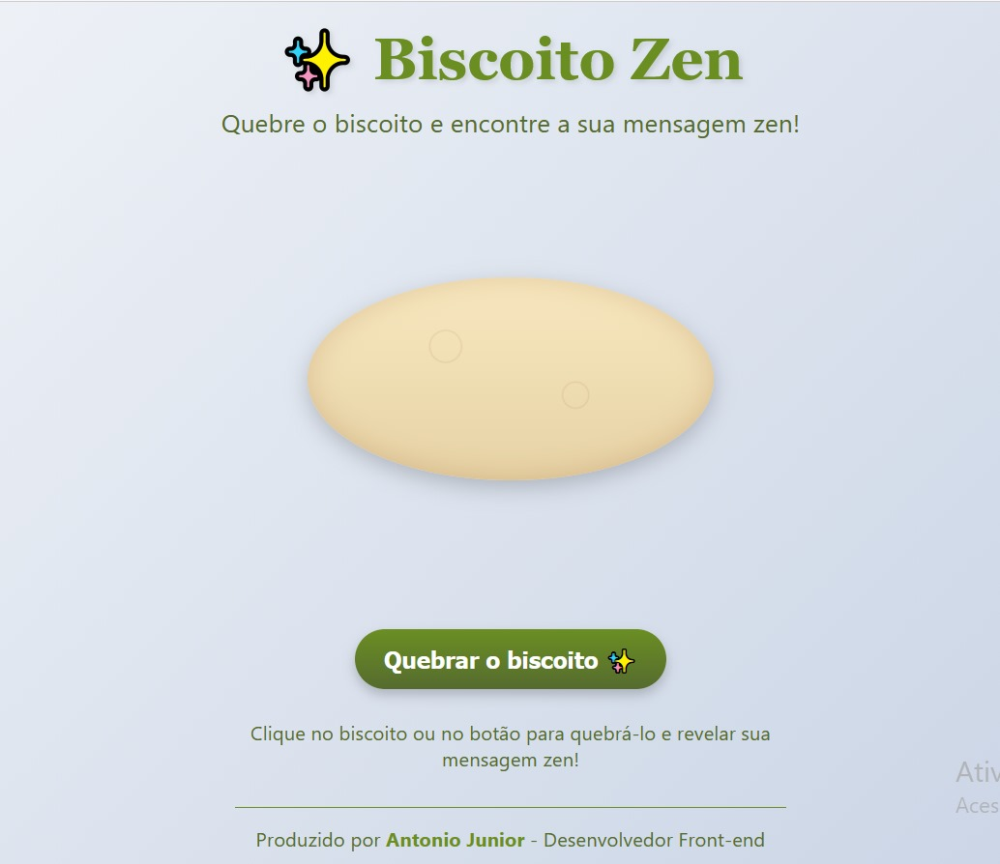
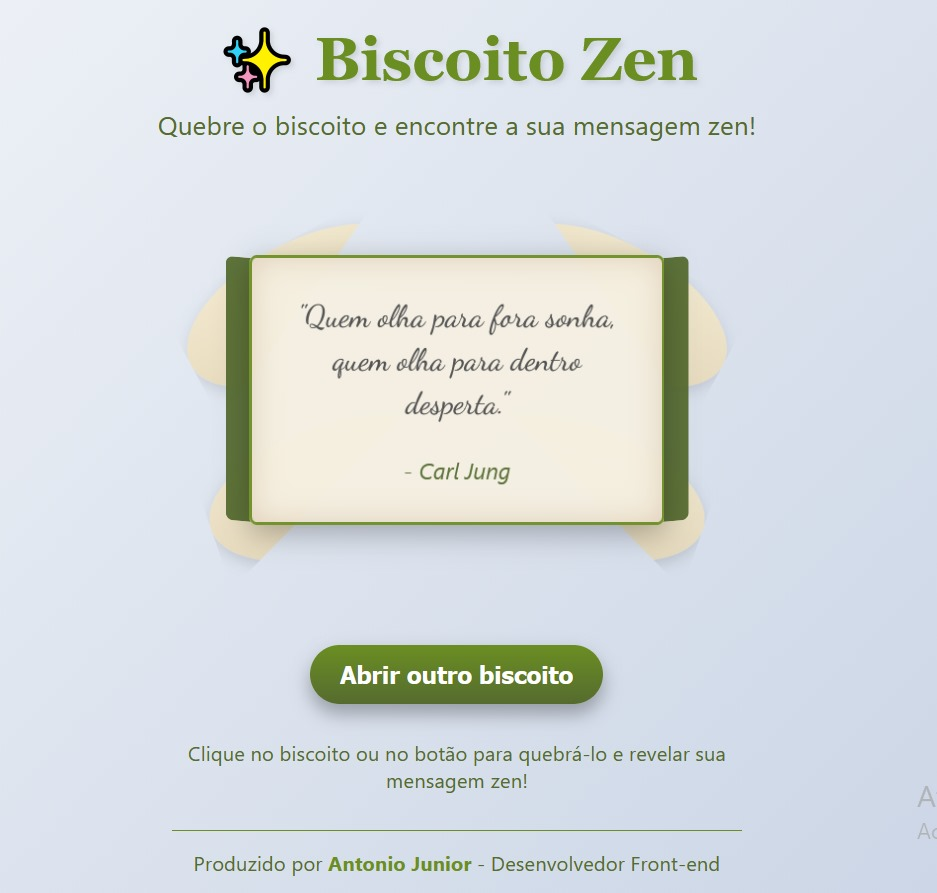

# 🥠 Biscoito Zen – Mensagens Inspiradoras Diárias

O **Biscoito Zen** é um projeto web interativo que simula a experiência de abrir um biscoito da sorte digital. Ao clicar no biscoito, ele se quebra e revela uma **mensagem motivacional** obtida através da API ZenQuotes. O objetivo é proporcionar uma experiência leve, divertida e inspiradora, unindo design simples e animação.

---

## ✨ Funcionalidades

- Animação de quebra do biscoito  
- Mensagem motivacional gerada automaticamente  
- Integração com API externa (ZenQuotes)  
- Experiência intuitiva e responsiva  

---

## 🛠️ Tecnologias Utilizadas

- **HTML5**  
- **CSS3**  
- **JavaScript**  
- **ZenQuotes API**

---

## 📌 Objetivo do Projeto

Praticar conceitos de Front-End como manipulação do DOM, integração com APIs e criação de interfaces animadas e responsivas.

---

## 📂 Estrutura do Projeto

/biscoito-zen
- │── index.html
- │── style.css
- │── script.js
- │── imagem/
- │ ├── imagem1.png
- │ ├── imagem2.png
- │── README.md
---

## 🚀 Como Usar

1. Abra o arquivo **index.html** no navegador  
2. Clique no biscoito da sorte  
3. Veja o pergaminho surgir com uma frase motivacional  

---

## 📈 Melhorias Futuras

- Mais efeitos de animação ao abrir o biscoito  
- Opção de salvar frases favoritas  
- Alterar tema do design (dark/light)  
- Adicionar som na interação  

---

## 👨‍💻 Autor

Projeto desenvolvido para fins de estudo e composição de portfólio
